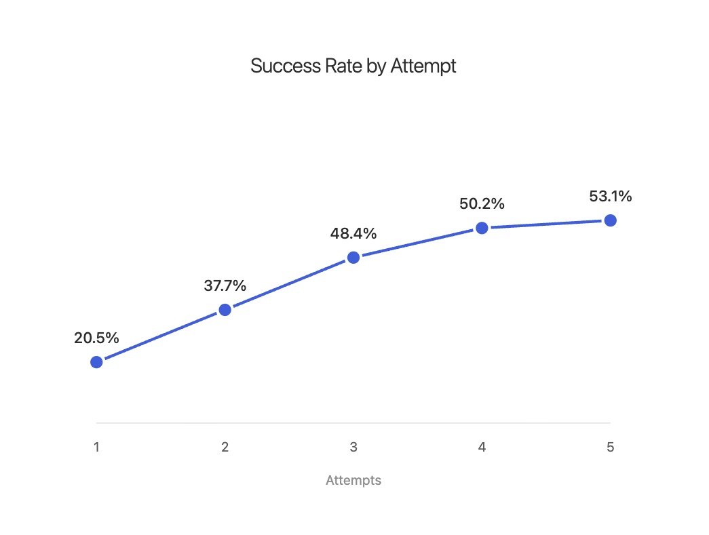
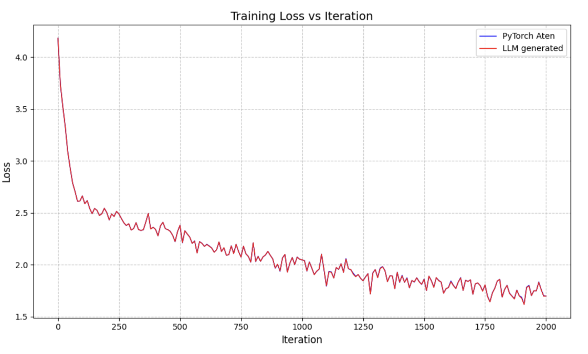
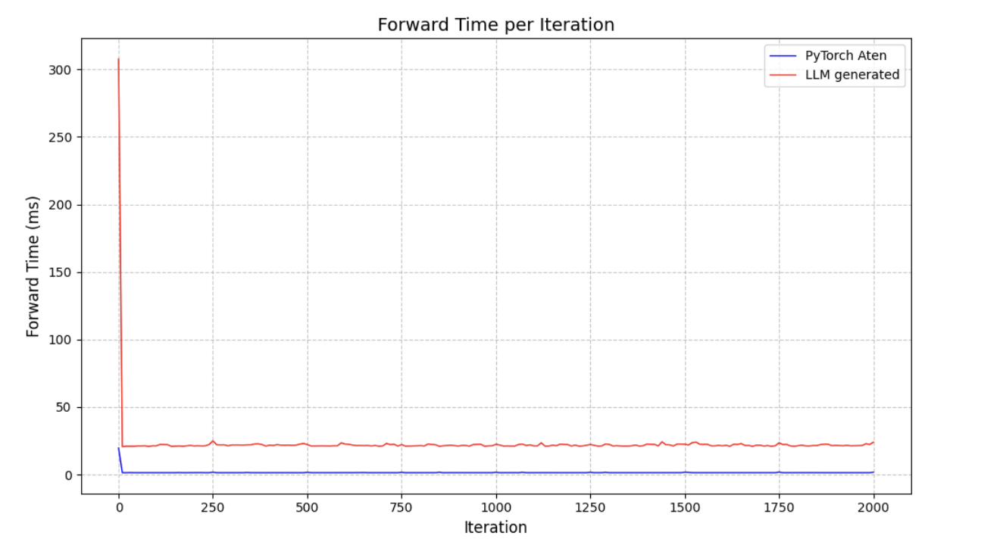

## Introducing BackendBench

Authors: 
* Evaluation: Mark Saroufim, Sahan Paliskara, Jiannan Wang, Bert Maher, Manuel Candales
* Science: Shahin Sefati, Laura Wang


BackendBench is an evaluation suite for testing how well LLMs and humans can write PyTorch backends. It lets developers add custom kernels in an organized directory structure and dynamically override PyTorch's core operators at runtime—resulting in a fully functional PyTorch backend you can pip install and use with existing models, no changes required.

It features
1. Comprehensive edge-case correctness testing via PyTorch's OpInfo suite for 271 operators
2. Performance benchmarks using real tensor shapes from popular Hugging Face models for 124 operators
3. Clean path to upstream your kernels to PyTorch (if it passes our tests, it's likely correct enough to merge)

In our first release we used this evaluation suite to produce a full inference PyTorch backend that implements the operators that show up in the most popular HuggingFace models written in easy to read Triton that anyone can just inspect. We hope to extend our work to training, distributed ops and more DSLs. The goal being that if new promising DSLs emerge that they can get get broad coverage for all of PyTorch.

On correctness testing, our initial attempts using a simple agentic loop on top of Claude with feedback show how repeated rounds with feedback on the OpInfo op suite can continue to improve the correctness of Triton kernels. 



We even took nano-gpt, registered our custom LLM kernels for the forward pass only and the numerics change. There's still some work to be done for correct backwards kernels which are hard for LLMs and to get the performance to be better, right now we're about twice as slow as PyTorch eager.




On performance testing: We ran a similar experiment on an older version of BackendBench using ChatGPT and would like to share with you the unfiltered Triton implementations for 84 operators which we've implemented in Triton using LLMs in [this PR](https://github.com/meta-pytorch/BackendBench/pull/111). We got all the interesting kernels correct. Most kernels run at 70–100% of PyTorch; a few are up to ~1.2× faster

The goal here is to convince you that writing high quality kernels is hard but why it's a worthwhile task for LLM researchers and how we hope BackenBench can help us measure progress.

## Why correctness in kernel generation is fundamentally hard

PyTorch has been battle-tested by millions of users over 9 years. Many edge cases, numerical precision issues, and hardware quirks have been reported over the years and fixed.

- **Operator variants**: Each operator like `torch.add()` supports multiple dtypes, broadcasting, in-place operations, pre-allocated outputs, and scaling factors
- **Edge cases**: NaN, infinity, zero-sized tensors, extreme shapes, mixed precision
- **Hardware differences**: Subtle floating-point behavior across different GPUs and drivers  
- **Picking the right shapes**: Tensors from actual models, not just convenient test sizes
- **Silent numerical errors**: Kernels that produce plausible but incorrect results, introducing subtle errors that compound through model layers

## Why existing approaches struggle

There's been a large and growing community of researchers interested in LLM kernel generation. This came about thanks to evaluation suites like [KernelBench](https://scalingintelligence.stanford.edu/blogs/kernelbench/) where the core paradigm is to view kernel generation as a translation task from some PyTorch reference implementation to an optimized CUDA implementation over randomized inputs.

Unfortunately, many efforts have faced major correctness issues. Most notably, this thread by [main_horse on X](https://x.com/main_horse/status/1892446384910987718) pointed out that some claimed 150x speedups were not reproducible. And similar reports often require some domain knowledge on GPU programming to notice. Our goal isn't to pick on any individual effort but instead attempt to engineer away both with code and process many of the correctness issues in the subfield of Kernel LLM generation.

## BackendBench's approach: Manual inspection + PyTorch focus

Our belief is that many correctness issues in Kernel LLM generation are domain specific footguns, most can be engineered away and the trickiest issues need to rely on human audits of individual kernels as opposed to inspection of macro level correctness and performance metrics.

### Directory based operators

Very core to our early design is that LLMs can trick the most clever evaluation infrastructure so relying purely on macro level evaluations is bound to miss things. So what we did was make it so all the kernels an LLM researcher need to generate kernels for are clear in a directory based structure.

```bash
generated_kernels
├── add
│   └── add_implementation_v1.py
├── bitwise_and
│   └── bitwise_and_implementation_v1.py
├── div
│   └── div_implementation_v1.py
├── fmod
│   └── fmod_implementation_v1.py
├── mul
│   └── mul_implementation_v1.py
└── relu
    └── relu_implementation_v1.py
```

That way if you do get promising speedups you can zip that folder and send it to your favorite performance engineer to debug. This protects us against a whole class of issues ranging from claiming victory when speedups exceed speed of light, bugs in the evaluation structure to some rogue agent making changes to the evaluation structure itself.


## PyTorch benchmarking footguns

Common benchmarking mistakes:

1. **Async execution**: Basic timing only measures kernel launch, not completion
   ```python
   # Wrong: doesn't wait for GPU completion
   tic = time.time()
   model(inp)
   toc = time.time()
   ```

2. **Warmup effects**: Running identical code sequentially gives misleading results due to caching
   ```python
   reference = eval(lambda a, b : a @ b, warmup=0)
   llm_generation = eval(lambda a, b : a @ b, warmup=0)  # Faster due to cache!
   ```

**Solution**: Use `triton.testing.do_bench()` which handles kernel synchronization, warmups, and L2 cache clearing between runs.

## Input distributions can render some solutions trivial

Let's say you wanted to create the world's fastest vector mean kernel. A natural thing you might do is create some large vector and initialize it using `torch.randn()`

```python
import torch
n = 1000000
x = torch.randn(n)
mean = x.mean()
assert torch.allclose(mean, torch.tensor(0.0), atol=0.01) # This will pass
```

This happens because `torch.randn()` draws from a normal distribution with mean 0 and variance 1. Statistically the mean of a large vector would simply be 0. So a smart agent might just output

```python
def super_smart_mean_kernel(x):
    return torch.tensor(0,0)
```

The way we mitigate this is we accept that testing an operator on a single example is error prone so on OpInfo correctness testing we have an average of 13 tests per op and for our torchbench performance testing we have an average of 110 tests per op. 

Speaking of torchbench now's the time to explain why

### Not all shapes are created equal

Another common mistake is to pick small shapes when benchmarking along the lines of `model.forward(torch.randn(4,4,4,4))` the problem being is in this regime we're neither memory bandwidth bound or compute bound but instead overhead bound and the only thing we're really measuring here is the time it takes to launch a CUDA kernel in PyTorch. Note that small shapes are crucial for correctness we don't generally expect PyTorch to crash on weirdly shaped inputs.

So the simplest fix to this problem is to pick the largest shapes we can, we can exponentially increase the sizes of our input tensors until we OOM and then slowly back off until we find a reasonably large shape. The results here will be more interesting than those with tiny shapes but fundamentally what most customers of PyTorch actually care about is performance on specific shapes i.e performance on important models.

So we end up with a dataset that looks like the below which also links to the original model the op and shape combination came from.

```
Operator: aten.add.Tensor
cnt: 156, ((T([1, 512, 768], f16), T([1, 512, 768], f16)), {})
cnt: 89, ((T([32, 128], f32), T([32, 128], f32)), {})
```

This shows `aten.add.Tensor` is called 156 times with 1×512×768 tensors (BERT embeddings). Hyperspecializing for these shapes matters more than generic optimization.

### Edge case handling with OpInfo

While large shapes matter for performance, correctness requires handling edge cases properly. PyTorch's [OpInfo infrastructure](https://pytorch.org/docs/stable/testing.html#module-torch.testing._internal.common_methods_invocations) provides comprehensive test cases that define clear semantics for what operators should do with:

- Tensors of size 0 or 1
- NaN and infinity values  
- Mixed dtypes and broadcasting edge cases
- Extreme shapes that stress memory allocation

OpInfo represents 9 years of user bug reports crystallized into test cases. If your kernel passes OpInfo tests, it handles the edge cases that real PyTorch users depend on. BackendBench leverages this to ensure LLM-generated kernels are robust enough for production use.

### Operator variants: One operator, many implementations

One unfortunate wrench is that `torch.add()` isn't one function - it's many:

```python
torch.add(torch.tensor([1, 2, 3], dtype=torch.float32), 5.0) # tensor + scalar
torch.add(torch.tensor([1, 2, 3]), torch.tensor([4, 5, 6])) # tensor + tensor
torch.add(torch.randn(2, 3), torch.randn(2, 3), out=torch.empty(2, 3)) # preallocated output
torch.add(torch.tensor([1.0, 2.0]), torch.tensor([[3.0], [4.0]]))  # broadcasting 
torch.add(torch.randn(3, 4, dtype=torch.bfloat16), torch.randn(4, dtype=torch.bfloat16), alpha=2.0) # scaling factor
```

Here's how BackendBench maps operator variants to a single implementation:

```
                  ┌──────────────────┐
                  │ generated_kernels│
                  │    └── add/      │
                  │         └── *.py │
                  └────────┬─────────┘
                           │
                  ┌────────▼────────┐
                  │   op_map.py     │
                  │  Maps variants  │
                  └────────┬────────┘
                           │
         ┌─────────────────┼─────────────────┐
         ▼                 ▼                 ▼
    add.Tensor        add_.Tensor        add.out
   (functional)       (in-place)      (pre-allocated)
         │                 │                 │
         └─────────────────┴─────────────────┘
                           │
                           ▼
                 Single implementation
                  handles all variants
```

And it's this consolidation that allows us to support a large set of PyTorch operators while maintaining a small set of operator folders.

### LLM cheating detection

LLMs often give up and fall back to PyTorch:

```python
except:
    # Fallback to PyTorch
    output = torch.randint(low, high, (n_elements,), dtype=dtype, device=target_device, generator=generator)
```

BackendBench catches this by actually running the kernels. If we override `torch.relu()` with a custom implementation that calls `torch.relu()`, we get infinite recursion.

### Uninteresting ops

There are some ops we filter out from the final eval suite either some are niche, others such as random ops are things we will support in a future release but for this section we'd like to talk about memory allocation APIs.

If you look at the [Triton tutorial for vector addition](https://triton-lang.org/main/getting-started/tutorials/01-vector-add.html#sphx-glr-getting-started-tutorials-01-vector-add-py) it has a kernel implementation for vector addition but the final driver program looks something like

```python
size = 98432
x = torch.rand(size, device=DEVICE)
y = torch.rand(size, device=DEVICE)
output_torch = x + y # This is the pytorch reference implementation
output_triton = add(x, y) # This is the triton kernel implementation
```

We don't expect memory allocation APIs to benefit from significant speedups, typically most kernel programs expect that their inputs and outputs will be PyTorch programs. Triton does a few nice things like ensure you're running on the same cuda device and stream as PyTorch to feel "native" and we expect more kernel language authors to follow suit.

That said we plan to version BackendBench releases to make it clear which ops we include and remove and we'll iterate with both the LLM research community and kernel engineers to make those decisions.

## Operator registration

### torch.library dispatch integration

BackendBench uses PyTorch's `torch.library` dispatch mechanism for operator registration:

```python
# BackendBench uses torch.library to register implementations
lib = torch.library.Library("aten", "IMPL", dispatch_key)
lib.impl("add.Tensor", custom_add_kernel_impl, "CUDA")
```

### What LLMs implement

Every operator directory contains a stub that LLMs fill out:

```python
import torch

def add_kernel_impl(*args, **kwargs):
    # LLM must implement the actual computation here
    # args[0]: first tensor
    # args[1]: second tensor or scalar
    # kwargs may contain 'alpha' scaling factor
    # Must return: args[0] + alpha * args[1]
    
    # Example correct implementation:
    x, y = args[0], args[1]
    alpha = kwargs.get('alpha', 1.0)
    # your custom_kernel here
```

This single implementation handles all variants (add.Tensor, add_.Tensor, add.out) through BackendBench's operator mapping.

## Getting Started

```bash
# Install BackendBench
pip install -e .

# Setup operator directories
python -m BackendBench.scripts.setup_operator_directories

# Run correctness tests
python BackendBench/scripts/main.py --suite opinfo --backend directory

# Run performance benchmarks
python BackendBench/scripts/main.py --suite torchbench --backend directory
```

```python
# Try with your own model
import torch
a = model()
import BackendBench
BackendBench.enable(kernel_dir="generated_kernels")
# Now run any PyTorch model - it will use your kernels!
model.forward(x)
```

We also provide an example of a LLM agent you can play around with which we used for our first generations with `--backend llm` where all you need is a Claude token. It has some rough edges so let us know if you have any feedback.

We welcome contributions to support new DSLs, leaderboards, training support and more feedback in the eval suite especially when it comes to low bit tolerences. We hope this release encourages more LLM researchers curious about writing correct and fast GPU code.

There's a lot more work we need to do to get the performance of LLM generated kernels to be compelling.




## Acknowledgements

We'd like to thank Alban Desmaison, Nikita Shulga and Joe Isaacson for invaluable feedback at the inception of BackendBench and helping us connect the world of PyTorch backends with that of LLM evaluation suites. We'd also like to thank Anne Ouyang, Simon Guo and Alex Zhang for pushing us to think harder about what it might mean to merge LLM generated kernels into PyTorch.