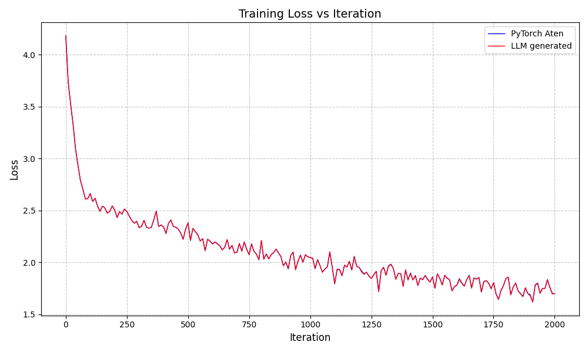
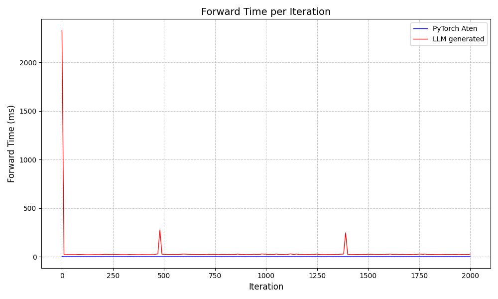

# Train nanoGPT using BackendBench with llm generated kernels
 
This example shows how to train nanoGPT using BackendBench with kernels generated by LLMs. The example is built upon @karpathy's nanoGPT project.

# Prerequisites
```
uv pip install tiktoken datasets
```

# Run

First, prepare the datasets.

```
cd data/shakespeare && uv run python prepare.py
```

Then, simply run `bash run.sh` to train nanoGPT using the example kernels in `example_kernels/`.

# Loss curve and forwarding time
Here are the training loss curve and forwarding time figures.


